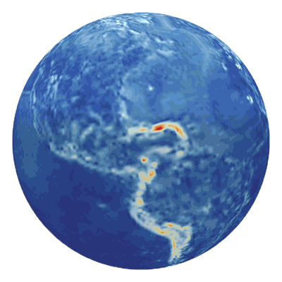

# Open Space Toolkit

[](https://discord.gg/tuHRnjuzWS)
[](https://opensource.org/licenses/Apache-2.0)

The Open Space Toolkit (**OSTk**) is a collection of versatile libraries for aerospace engineering use, available in:

- **C++** – the reference implementation, for portability and performance.
- **Python** – via C++ bindings, formidable for interactive use and prototyping.



## Getting Started

Want to get started? This is the simplest and quickest way:

[](https://mybinder.org/v2/gh/open-space-collective/open-space-toolkit/main?urlpath=lab/tree/notebooks)

*This will automatically start a [JupyterLab](https://jupyterlab.readthedocs.io/en/stable/) environment in your web browser with Open Space Toolkit libraries and example notebooks ready to use. Nothing to download or install! 🚀*


### Local JupyterLab in Docker

Alternatively, you can run a pre-installed OSTk environment on your local machine. This process has the following requirements:
- [Docker](https://docs.docker.com/get-docker/)
- [Git](https://git-scm.com/downloads)
- [GNU Make](https://www.gnu.org/software/make/)

The following commands will start a [JupyterLab](https://jupyterlab.readthedocs.io/en/stable/) server within a Docker container where the OSTk components are already installed:

```shell
# clone this repo
git clone https://github.com/open-space-collective/open-space-toolkit.git && cd open-space-toolkit

# Run the jupyter server inside of Docker
make run-jupyter
```

Once the container is running, access [http://localhost:8888/lab](http://localhost:8888/lab) and create a Python 3 Notebook.


## Components

| Name                                                                                       | Description                                                   | Version                                                                                                                                                                                      |
| ------------------------------------------------------------------------------------------ | ------------------------------------------------------------- | -------------------------------------------------------------------------------------------------------------------------------------------------------------------------------------------- |
| [Core](https://github.com/open-space-collective/open-space-toolkit-core)                   | Fundamental types, containers and utilities.                  | [](https://badge.fury.io/gh/open-space-collective%2Fopen-space-toolkit-core)                   |
| [I/O](https://github.com/open-space-collective/open-space-toolkit-io)                      | Addressing, networking, database connectors.                  | [](https://badge.fury.io/gh/open-space-collective%2Fopen-space-toolkit-io)                       |
| [Mathematics](https://github.com/open-space-collective/open-space-toolkit-mathematics)     | Geometry, curve fitting, optimization.                        | [](https://badge.fury.io/gh/open-space-collective%2Fopen-space-toolkit-mathematics)     |
| [Physics](https://github.com/open-space-collective/open-space-toolkit-physics)             | Physical units, time, reference frames, environment modeling. | [](https://badge.fury.io/gh/open-space-collective%2Fopen-space-toolkit-physics)             |
| [Astrodynamics](https://github.com/open-space-collective/open-space-toolkit-astrodynamics) | Orbit, attitude, access.                                      | [](https://badge.fury.io/gh/open-space-collective%2Fopen-space-toolkit-astrodynamics) |

## Support

- [Use Cases](./docs/Use%20Cases.md)
- [Frequently Asked Questions](./docs/FAQ.md)

## Using OSTk in your applications

To help jump-start using OSTk, here is a simple Docker image that you can use to create your applications.
We have leveraged C++20 compatibility and compiled the packages with G++ 13. 

Since most LTS linux flavors don't yet come default with G++13, the installation of the package is done manually.
**These instalations can be removed when Ubuntu version >= 24.0 or debian >= 13.0**

### Docker

```docker
ARG PYTHON_BASE_VERSION="3.11"

# Open Space Toolkit install image

# This is a Debian based image
FROM mcr.microsoft.com/vscode/devcontainers/python:${PYTHON_BASE_VERSION}

ARG OSTK_DATA_LOCAL_CACHE="/var/cache/open-space-toolkit-data"

## Install OSTk data install dependencies

RUN apt-get update && \
    apt-get install -y git-lfs && \
    rm -rf /var/lib/apt/lists/*


## Install GCC/G++ 13
RUN echo "deb http://deb.debian.org/debian testing main" > /etc/apt/sources.list.d/testing.list

# Set testing repository to lower priority
RUN printf 'Package: *\nPin: release a=testing\nPin-Priority: 100\n' > /etc/apt/preferences.d/testing

# Update package lists and install required packages
RUN apt-get update && apt-get install -y \
    build-essential \
    wget \
    && rm -rf /var/lib/apt/lists/*

# Install the latest GCC from testing
RUN apt-get update && apt-get install -y -t testing gcc g++ && rm -rf /var/lib/apt/lists/*


## Seed OSTk Data

ENV OSTK_PHYSICS_DATA_LOCAL_REPOSITORY="${OSTK_DATA_LOCAL_CACHE}/data"

RUN git clone \
    --branch=v1 \
    --single-branch \
    --depth=1 \
    https://github.com/open-space-collective/open-space-toolkit-data.git ${OSTK_DATA_LOCAL_CACHE} && \
    chmod -R g+w ${OSTK_DATA_LOCAL_CACHE}

## Update user id and group id with local ones

ARG USERNAME="vscode"
ARG USER_UID="1000"
ARG USER_GID=${USER_UID}
RUN sudo groupmod --gid ${USER_GID} ${USERNAME} && \
    sudo usermod --uid ${USER_UID} --gid ${USER_GID} ${USERNAME}

USER ${USERNAME}

## Install dependencies

COPY --chown=${USER_UID}:${USER_GID} pyproject.toml /home/${USERNAME}/tmp/

RUN cd /home/${USERNAME}/tmp/ && \
    pip --no-cache-dir install --user .[dev] && \
    rm -rf /home/${USERNAME}/tmp/

## Change default entrypoint to bin/zsh

ENTRYPOINT ["/bin/zsh"]

## Change default entrypoint folder to /app

WORKDIR /app
```

### NOTE : For Ubuntu, the installation of GCC/G++13, replace 

```docker

## Install GCC/G++ 13
RUN echo "deb http://deb.debian.org/debian testing main" > /etc/apt/sources.list.d/testing.list

# Set testing repository to lower priority
RUN printf 'Package: *\nPin: release a=testing\nPin-Priority: 100\n' > /etc/apt/preferences.d/testing

# Update package lists and install required packages
RUN apt-get update && apt-get install -y \
    build-essential \
    wget \
    && rm -rf /var/lib/apt/lists/*

# Install the latest GCC from testing
RUN apt-get update && apt-get install -y -t testing gcc g++ && rm -rf /var/lib/apt/lists/*
```
by 
```docker
## Install GCC/G++ 13

# Update package lists and install required packages
RUN apt-get update && apt-get install -y \
    software-properties-common \
    && rm -rf /var/lib/apt/lists/*

RUN add-apt-repository ppa:ubuntu-toolchain-r/test \
    && apt-get update \
    && apt-get install gcc-13 g++-13 -y
```


### pyproject.toml

And an accompanying `pyproject.toml` file that should be in the same folder.

```toml
[project]
name = "my-app"
requires-python = ">=3.11"

dynamic = ["version"]

dependencies = [
    "open-space-toolkit-simulation~=X.Y.Z",
]

[project.optional-dependencies]
dev = [
    # Development libraries
    "ipython~=8.24",
]
```

### Build and Run

You can then build the Docker image via:
```
docker build . -t my-app
docker run -it --rm my-app
```

Enjoy!

## Contributing

Contributions are more than welcome!

Please read our [contributing guide](CONTRIBUTING.md) to learn about our development process, how to propose bugfixes and improvements, and how to build and test the code.

## Special Thanks

[](https://www.loftorbital.com/)

## License

Apache License 2.0
